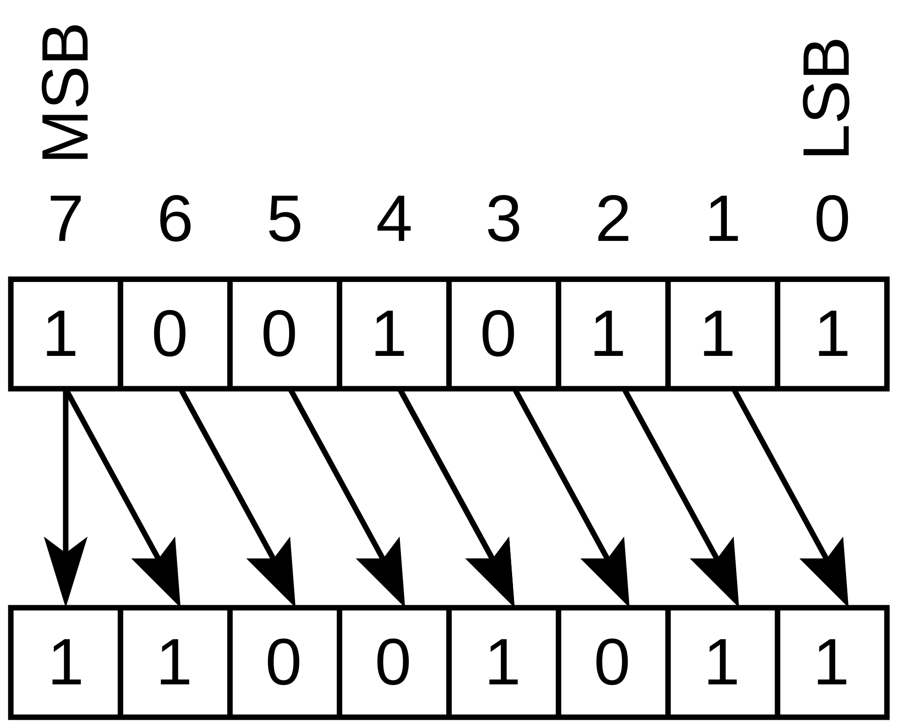
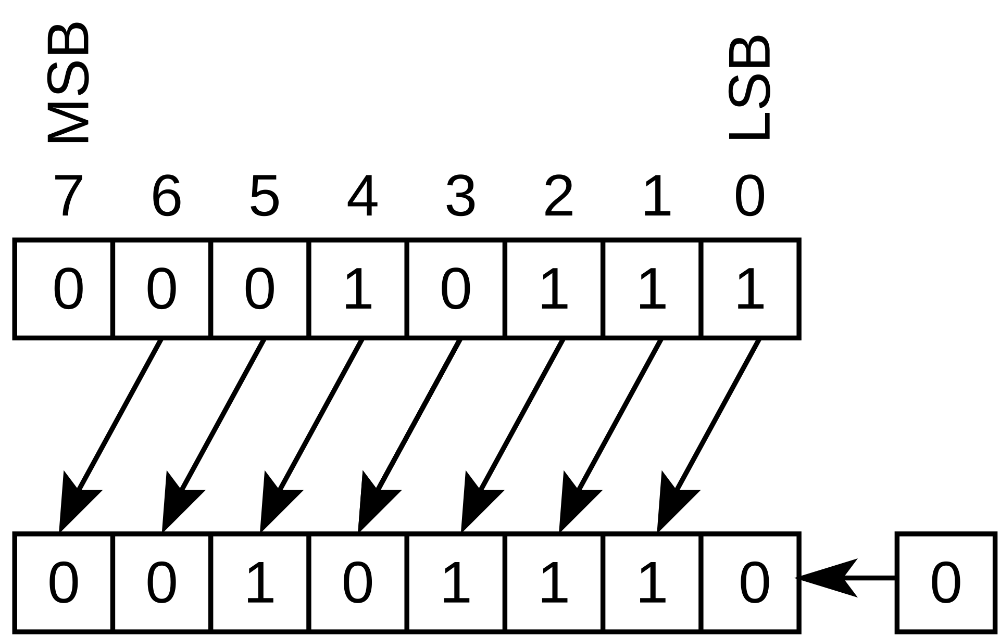
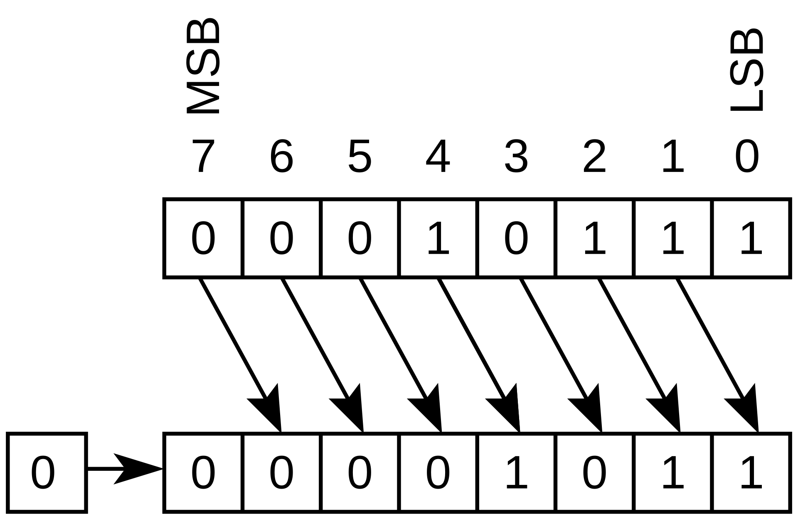

# Coding Style

* 組合邏輯用 = (blocking)，循序邏輯用 <= (blocking)

* sensitivity list 用 always(*)

* 在設計電路時要盡量避免 Latch 的產生

* 組合邏輯中 if/case 條件要寫滿，否則 Design Complier 在合成的時候在非條件狀態下加上 Latch 以確保其值不會改變

* 如果有 Feedback 就需要加上 Flip-Flop (FF)

* Latch 只會在 Combinational 中出現

* 不要使用 conditional reset

* 不要直接拿 Input data 做運算，先用 FF 存起來，若輸入序列一筆一筆進入，用 Shift Register (FIFO or SIPO)

* Output 也先用 FF 儲存後再送出

* 使用 FSM 控制電路

* 無號數運算成有號數:  
```verilog
wire [2:0] a,b;  
wire signed [3:0] result;  
assign result = $signed({1'b0, a}) - $signed({1'b0, b});  
```

* 運算化簡  
1. 乘以常數可以用 2 的冪次組合:  
```verilog
(O) assign b = a * 5;  
(X) assign b = (a << 2) + a;  
```
2. 除以 2 的冪次要注意精度，可以將整個式子乘以 2 的冪次 (將最低冪次令為常數):  
```verilog
(O) assign b = (a >>> 1) + a;  
(X) assign bx2 = a + (a << 1); 
``` 
3. 取 2 的冪次餘數:  
```verilog
(O) assign b = a % 16;  
(X) assign b = a[3:0];
```  
4. 判斷奇偶:  
```verilog
assign b = a[0]; // b 為 1 的話 a 是奇數 為 0 則 a 是偶數
```

* 左位移用 << 邏輯左移，右位移用 >>> 算術位移    

| 算術左移 | 算術右移 | 邏輯左移 | 邏輯右移 |
| :---: | :---: | :---: | :---: |
| <div style="background-color:white; padding:10px; display:inline-block;"></div> | <div style="background-color:white; padding:10px; display:inline-block;"></div> | <div style="background-color:white; padding:10px; display:inline-block;"></div> | <div style="background-color:white; padding:10px; display:inline-block;"></div> |

* 確保 Pipeline 資料對齊（Data Alignment）： 設計管線時務必注意各節點的資料時序。若運算路徑長度不同，最簡單的解決方式是插入 Bubble（空拍 / 延遲暫存器）來對齊資料，避免不同時序的舊資料與新資料發生誤算  

* 控制與資料路徑分離（Decoupling）： FSM 與 Pipeline 必須分開設計。FSM 專職於「控制邏輯」（發號施令、驅動組合邏輯或決定資料存取），而 Pipeline 專職於「資料運算」

* 狀態切換策略： 盡量避免使用「計數器」作為 FSM 狀態跳轉的條件。最佳實務是透過握手協定（Handshake）來結合 FSM 與 Pipeline，看訊號做事而非死記時間 

| 比較項目 | 計數器 (Counter) | 握手 (HandShake) |
| :--: | :--: | :--: |
| 吞吐量 (Throughput) | 無法重疊（卡死）： 第一筆資料進入後，FSM 進入等待並開始倒數，期間無法接收新資料，抹殺了 Pipeline 的最大優勢。 | 完美重疊（100% 吞吐量）： 標記宛如追蹤條碼（如 [1, 1, 1]），支援每個 Clock 連續輸入，同時追蹤多筆不同階段的資料。 |
| 維護與擴充性 | 牽一髮而動全身： 若管線級數改變（例如 2 級變 4 級），必須回頭修改 FSM 程式碼，極容易引發連鎖錯誤。 | 完美解耦（Decoupling）： FSM 只認 pipe_done 訊號，完全不知道管線有幾級。增減管線級數時，FSM 邏輯一行都不用改。 |
| 應對下游塞車 (Stall) | 系統崩潰： 遇到下游暫停時，計數器無法記錄管線中多筆資料的具體位置（哪一級有資料、哪級是空的）。 | 從容停頓： 搭配 Ready 訊號，Valid 標記能直接停在原地（維持狀態不動），待塞車解除再繼續傳遞，資料絕不亂掉。 |  

* 握手協定是確保資料在同步電路中安全傳遞的機制，主要由兩個控制訊號組成：  

      Valid（有效訊號）： 由**「發送方 (Sender)」**產生，代表送出的資料是有效、可用的。  

      Ready（準備就緒訊號）： 由**「接收方 (Receiver)」**產生，代表接收端內部有空，已準備好接收新資料。

    握手成功條件： 在同一個 Clock 上升緣（Posedge），只有當 Valid == 1 且 Ready == 1 同時成立時，握手才算成功，資料也才會真正從發送方轉移到接收方。  
