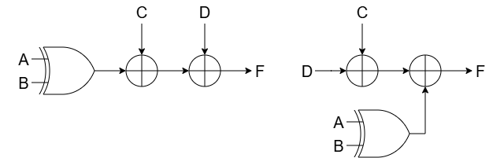

# Coding Style

* sensitivity list 用 always(*)

* 組合邏輯用 = (blocking)，循序邏輯用 <= (blocking)

``` verilog
always @(*) begin
    out = a;
end

always @(posedge clk) begin
    out <= a;
end
```

* 在設計電路時要盡量避免 Latch 的產生

* 組合邏輯中 if/case 條件要寫滿，否則 Design Complier 在合成的時候在非條件狀態下加上 Latch 以確保其值不會改變

* 如果有 Feedback 就需要加上 Flip-Flop (FF)

* Latch 只會在 Combinational 中出現

* 不要使用 Conditional reset 或 Gated clk

* 不要直接拿 Input data 做運算，先用 FF 存起來，若輸入序列一筆一筆進入，用 Shift Register (FIFO or SIPO)

* Output 也先用 FF 儲存後再送出

* 不要訊號重複賦值 (在多個地方被賦值)

* 盡量使用 FSM 控制電路

* 盡量將每個訊號獨立一個 always block，之後比較好 Debug 且合成器比較看得懂會更好優化

* 善用括號以盡量使用樹狀結構減少使用線性結構 (縮短 Critical Path)

``` verilog
// 線性結構 ((a + b) + c) + d;
assign z = a + b + c + d;
// 樹狀結構
assign z = (a + b) + (c + d);
```

* 延遲越長的 Signal 盡量放接近輸出一點，可以縮短其 Critical Path


* 共用元件: 如果一個加法器在不同的運算中不會同時使用，則應在 if-else 或 case 中共用同一個加法器，而非寫兩個 (有些合成器可能會將 if-else 中的資源共用但非全然)

``` verilog
//優化前
if (sel) out = a + b;
else out = c + d;

//優化後
assign op1 = sel ? a : c;
assign op2 = sel ? b : d;
assign out = op1 + op2;
```

* 如果有未用到的case可以用 don’t care讓合成器更好優化電路 (高可靠除外)

``` verilog
module mux_2 (a,b,c,d,sel,out);
    input [7:0] a,b,c,d;
    input [1:0] sel;
    output reg [7:0] out;

always @(*) begin
    case (sel)
        0: out = a;
        1: out = b;
        2: out = c;
        3: out = d;
        default: out = 8'bx;
    endcase
end
endmodule
```

* 若 output 為 z (high impedance) 先確認 tcl 合成檔中有加入 don't touch 的約束條件，兩個訊號等價可能會導致某一訊號被優化成 z

``` verilog
reg [15:0] reg_0 ;
reg [15:0] reg_1 ;
reg [15:0] reg_2 ;
reg [15:0] reg_3 ;
reg [15:0] reg_array [0:3] ;

always @(*) begin
    reg_array[0] = reg_0 ;
    reg_array[1] = reg_1 ;
    reg_array[2] = reg_2 ;
    reg_array[3] = reg_3 ;
end
```

* 無號數運算成有號數:  

```verilog
wire [2:0] a,b;  
wire signed [3:0] result;  
assign result = $signed({1'b0, a}) - $signed({1'b0, b});  
```

* 運算化簡  

1. 乘以常數可以用 2 的冪次組合:  
  
```verilog
(O) assign b = a * 5;  
(X) assign b = (a << 2) + a;  
```

1. 除以 2 的冪次要注意精度，可以將整個式子乘以 2 的冪次 (將最低冪次令為常數):  

```verilog
(O) assign b = (a >>> 1) + a;  
(X) assign bx2 = a + (a << 1); 
```  

1. 取 2 的冪次餘數:  

```verilog
(O) assign b = a % 16;  
(X) assign b = a[3:0];
```  

1. 判斷奇偶:  

```verilog
assign b = a[0]; // b 為 1 的話 a 是奇數 為 0 則 a 是偶數
```

* 左位移用 << 邏輯左移，右位移用 >>> 算術位移  

* 確保 Pipeline 資料對齊（Data Alignment）： 設計管線時務必注意各節點的資料時序。若運算路徑長度不同，最簡單的解決方式是插入 Bubble（空拍 / 延遲暫存器）來對齊資料，避免不同時序的舊資料與新資料發生誤算  

* 控制與資料路徑分離（Decoupling）： FSM 與 Pipeline 必須分開設計。FSM 專職於「控制邏輯」（發號施令、驅動組合邏輯或決定資料存取），而 Pipeline 專職於「資料運算」

* 狀態切換策略： 盡量避免使用「計數器」作為 FSM 狀態跳轉的條件。最佳實務是透過握手協定（Handshake）來結合 FSM 與 Pipeline，看訊號做事而非死記時間  

* 進行數值運算後的位元數，令 $A$ 的位元寬度為 $M$、$B$ 的位元寬度為 $N$
  1. 加法 ($A + B$)所需位元數： $\max(M, N) + 1$  
  原因： 兩個數相加時，有可能會向最高位產生進位（Carry out）。例如兩個無號 8-bit 的數相加，最大值為 $255 + 255 = 510$，需要 9 個 bits 才能完整表示。

  1. 減法 ($A - B$)所需位元數： $\max(M, N) + 1$  
  原因： 硬體中的減法通常會轉換為加上二補數（2's complement）。即使原本是無號數，相減的結果也可能為負，因此需要擴展一個位元來作為符號位元（Sign bit）並容納可能的數值範圍。

  1. 乘法 ($A \times B$)所需位元數： $M + N$  
  原因： 乘法結果的動態範圍會呈指數成長。例如一個 4-bit 的數（最大數值 15）乘上一個 3-bit 的數（最大數值 7），結果最大為 $15 \times 7 = 105$，需要 $4 + 3 = 7$ 個 bits 才能表示。

  1. 除法 ($A / B$) 商數 (Quotient) 所需位元數： $M$  
  原因： 極端情況下，當除數 $B = 1$ 時，商數會完全等於被除數 $A$，因此商數最多需要與被除數相同的位元數。  

  1. 餘數 (Remainder) 所需位元數： $N$  
  原因： 餘數永遠會小於除數 $B$，因此餘數的位元寬度最多只需要與除數的位元寬度相同。  
